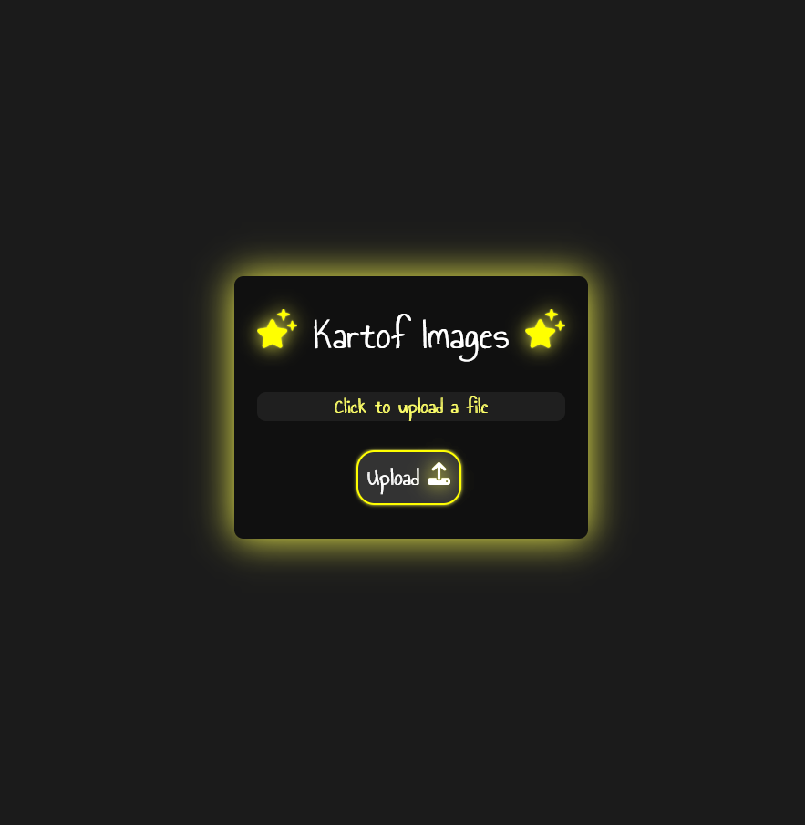

<b><h1>Kartof Images</h1></b>

<b>Kartof Images</b> is my first REAL rust project made using only one crate - serde_json and ofc the included libs in rust. I wrote the whole http server by hand so the security will probably be not so good.  In short terms this is a image host website where you upload an image and you get the url of it.😁

  

 
(the ui is bad i know but the main focus is the rust back-end)

## Recommended IDE Setup

- [VS Code](https://code.visualstudio.com/) + [rust-analyzer](https://marketplace.visualstudio.com/items?itemName=rust-lang.rust-analyzer)

## Configuration

Just run/build it and the default port is 7878.

## Disclaimer

<b>
I am not responsible for any illegal usages or images stored using this.</b>
 
